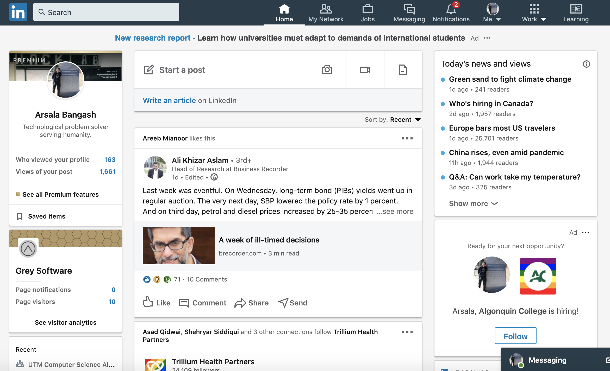
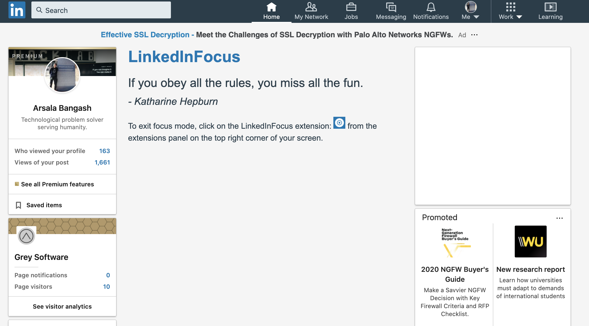

    

# LinkedInFocus

LinkedInFocus is a web extension that allows you to hide the news feed and news panel on LinkedIn so you can focus on your career!

### Running Locally

The extension lives under the __src__ directory.

Use [this guide](https://developer.chrome.com/extensions/getstarted) to load the extension into chrome.

Before                     |  After
:-------------------------:|:-------------------------:
  |  

  
  

    

